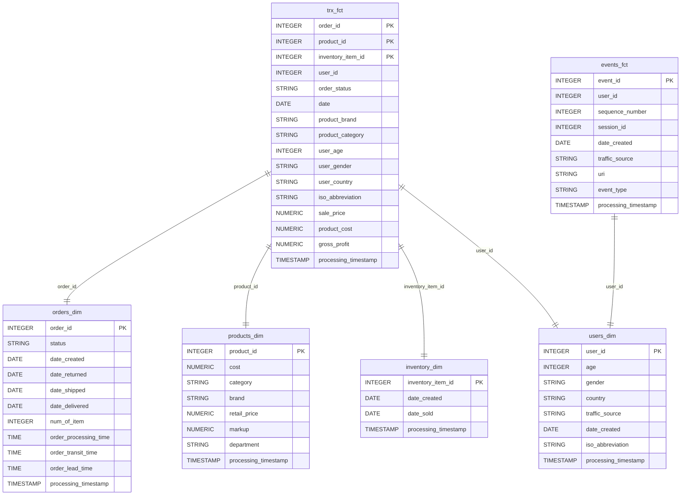

# Porygon Pipelines: Enterprise Data Engineering with Google Dataform

> **A production-ready data engineering project demonstrating a modern data stack implementation, enterprise-grade governance, and scalable analytics infrastructure.**

## Executive Summary

This project solves the **critical business problem of data silos and delayed insights** by implementing a modern, cloud-native data pipeline that transforms raw e-commerce data into actionable business intelligence. Built with **Google Dataform**, **BigQuery**, **Storage** and **Looker Studio**, it delivers:

- **Centralized Single Source of Truth (SST)** removing data fragmentation and enabling faster time-to-insight through automated, real-time data processing and self-service analytics.
- **Data accuracy** through comprehensive data quality frameworks ensuring data consistency and providing clarity on data lineage.
- **Efficient operations** through reduced cost due to its server-less architecture. It removes scalability bottle-necks through to its modular pipeline design and star schema data model.
---

## The Need Addressed
Before this implementation, the e-commerce company with name **The Look E-commerce** faced the below issues:

- **Data fragmentation** across multiple systems.
- **Manual, error-prone ETL processes** that delay decision-making.
- **Lack of standardization and clarity on data lineage** creating compliance and trust issues.
- **Scalability bottlenecks** as data volumes grew exponentially.

---

## Technology Stack Rationale

I decided to build this solution using Google due my familiarity with its ecosystem and its significant advancements in AI technologies. The google resources I chose to build this solution are: 

| Product | Description | Decision Factor | 
|--------|------------|------------|
| **BigQuery** | Serverless data warehouse for storing and querying structured data at petabyte scale using SQL. |Performative, Scalable, Cost-efficient, Seamless integration, Supports analytics | 
| **Dataform** | A data transformation and orchestration tool built specifically for SQL-based pipelines in BigQuery.| Git version-control through git, Data-lineage clarity,  Data Quality Checks and Unit-Testing Integrations, Works directly in BigQuery without the need of additional infrastructure. |
| **Looker studio** | Business intelligence (BI) and visualization tool that connects directly to BigQuery and other data sources | Seamless BigQuery integration, Supports real time updates. |
| **Cloud Storage** | A secure, scalable object storage system for raw and semi-processed data (CSV, Parquet, JSON, logs, etc.). | Seamless integration with BigQuery external tables, Cost efficient. |

---

## Data Model

---

## Total Cost of Ownership (TCO)

Based on current consumption, I estimate this project to cost a maximum of $13 per month.

## Business Intelligence Dashboards

### 1. Executive Summary Dashboard
[View Dashboard](https://lookerstudio.google.com/embed/reporting/224a01ba-2006-4fc4-91ba-c20807589a23/page/Gg3)  

### 2. Profit Matrix per Category Dashboard
[View Dashboard](https://lookerstudio.google.com/embed/reporting/224a01ba-2006-4fc4-91ba-c20807589a23/page/p_4gtrw0g7wd)  
